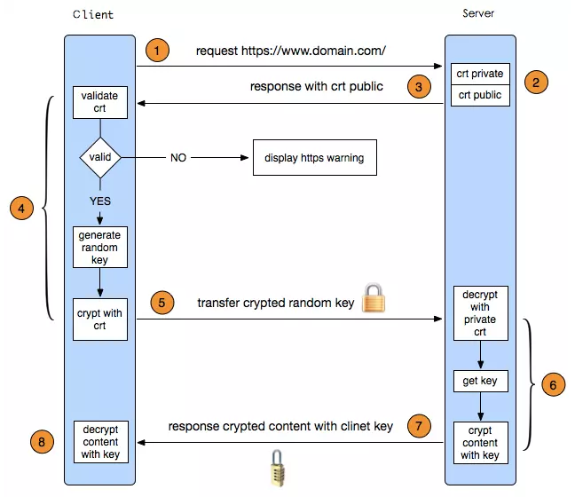

# HTTPS 原理

1. **客户端发起HTTPS请求**：就是用户在浏览器里输入一个 HTTPS 网址，然后连接到服务端的 443 端口。
2. **服务端的配置**：采用 HTTPS 协议的服务器必须要有一套数字证书，可以自己制作，也可以向组织申请。区别就是自己颁发的证书需要客户端验证通过，才可以继续访问，而使用受信任的公司申请的证书则不会弹出提示页面。这套证书其实就是一对公钥和私钥。
3. **传送CA证书**：这个证书包含**服务器的公钥**和**CA的公钥(解密用)**，还包含了很多信息，如证书的颁发机构，过期时间等等，其中比较重要的。
4. **客户端解析证书**：这部分工作是由客户端的 SSL/TLS 来完成的，首先会使用证书中的 CA 公钥解密，然后验证公钥是否有效，比如颁发机构，过期时间等等，如果发现异常，则会弹出一个警示框，提示证书存在的问题。如果证书没有问题，那么就生成一个**随机值**。然后用证书（也就是公钥）对这个随机值进行加密。**传送加密信息**：这部分传送的是用证书加密后的随机值，目的是让服务端得到这个随机值，以后客户端和服务端的通信就可以通过这个随机值来进行加密解密了。
5. **服务端解密信息**：服务端用私钥解密后，得到了客户端传过来的随机值，然后把内容通过该随机值进行对称加密，将信息和私钥通过某种算法混合在一起，这样除非知道私钥，不然无法获取内容，而正好客户端和服务端都知道这个私钥，所以只要加密算法够彪悍，私钥够复杂，数据就够安全。
6. **传输加密后的信息**：这部分信息就是服务端用私钥加密后的信息，可以在客户端用随机值解密还原。
7. **客户端解密信息**：客户端用之前生产的私钥解密服务端传过来的信息，于是获取了解密后的内容。整个过程第三方即使监听到了数据，也束手无策。